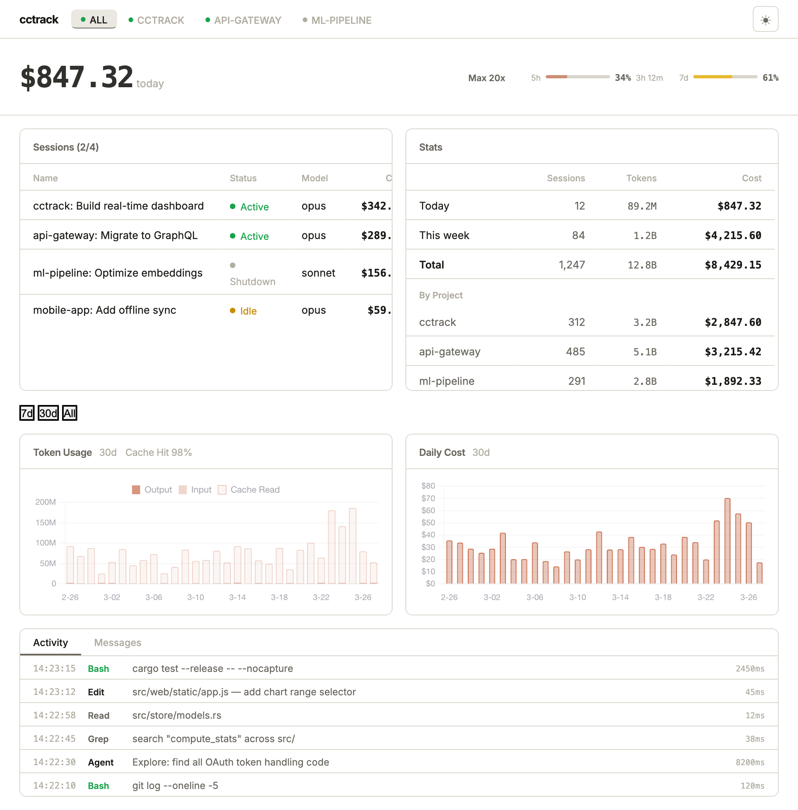
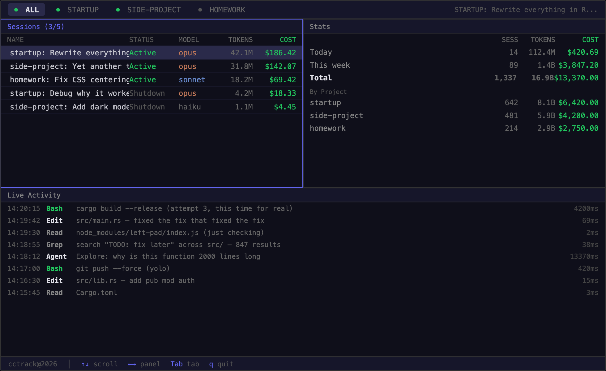

<div align="center">

# cctrack

**Real-time Claude Code agent monitor. See what they're doing — and what it costs.**

> A tiny Rust daemon that watches your agents work. Always on, <10MB RAM.

[](https://github.com/haoagent/cctrack)
[](https://opensource.org/licenses/MIT)
[](https://www.rust-lang.org/)
[](https://docs.anthropic.com/en/docs/claude-code)



*Web Dashboard*



*Terminal UI*

</div>

## Install

```bash
# Download pre-built binary (macOS / Linux)
curl -fsSL https://github.com/haoagent/cctrack/releases/latest/download/cctrack-$(uname -m)-apple-darwin.tar.gz | tar xz
sudo mv cctrack /usr/local/bin/

# Or build from source (requires Rust)
git clone https://github.com/haoagent/cctrack && cd cctrack
cargo install --path .
```

## Quick Start

```bash
cctrack hooks install    # one-time: adds a hook to ~/.claude/settings.json
cctrack --web            # starts TUI + web dashboard
```

Open **http://localhost:7891** in your browser. Use Claude Code normally — cctrack picks up everything automatically.

Sessions with sub-agents get their own tab. Tabs appear when agents spawn and disappear after all agents shut down. The ALL tab always shows every session.

## Features

- **💰 Live Cost** — real-time cost tracking, updated as agents work
- **📊 Sessions** — every active session with status, model (opus/sonnet/haiku), and running cost
- **📈 Charts** — 30 days of token usage (stacked: output, input, cache) and daily cost with 7d/30d/All selector
- **🎯 Cache Hit Rate** — see if caching is actually working (spoiler: 97%)
- **⚡ Quota Monitor** — real 5h and 7d usage from Claude's OAuth API. No more surprise rate limits (see [Connect to Claude](#connect-to-claude) below)
- **🔍 Live Activity** — watch tool calls happen: `Bash`, `Edit`, `Read`, `Grep`, `Agent` — with duration
- **🤖 Agent Teams** — see sub-agents, their models, individual costs. Track the full team tree
- **📋 Cost Breakdown** — by session, by agent, by project. Know exactly where every dollar went
- **🖥️ Web + TUI** — browser dashboard (SSE) or lightweight terminal UI
- **🔒 Local-Only** — all computation on your machine. No telemetry, no cloud
- **🦀 Tiny Footprint** — 292KB source, 5,500 lines of Rust, ~3MB binary, <10MB RAM

## Usage

```bash
# Dashboard
cctrack                     # TUI dashboard
cctrack --web               # TUI + web dashboard
cctrack --web-only          # web only (localhost:7891)

# Tools
cctrack stats               # quick cost summary in terminal
cctrack pricing-check       # validate pricing vs LiteLLM

# Hooks
cctrack hooks install       # add hook to Claude Code
cctrack hooks uninstall     # remove hook
```

## TUI

| Symbol | Color | Status |
|--------|-------|--------|
| ● | Green | Active — running right now |
| ○ | Yellow | Idle — waiting for input |
| · | Gray | Shutdown — session ended |

| Key | Action |
|-----|--------|
| `↑↓` / `jk` | Scroll within panel |
| `←→` | Switch panel |
| `Tab` | Cycle session tabs |
| `q` | Quit |

## What `hooks install` Does

It adds one line to `~/.claude/settings.json`:

```json
{
  "hooks": {
    "postToolExecution": "curl -s -X POST http://localhost:7890/hook -d @-"
  }
}
```

Tool call events go to cctrack's local server. **Nothing leaves your machine.** Run `cctrack hooks uninstall` to remove it.

## How It Works

```
You ──→ Claude Code ──→ transcripts (~/.claude/projects/)
                    └──→ hook events (localhost:7890)
                              │
                       ┌──────┴──────┐
                       │  TUI   Web  │
                       │      SSE    │
                       └─────────────┘
```

## Tech

Single Rust binary. Ratatui (TUI) + Axum (web + SSE) + Chart.js (CDN). tokio async.

This entire project was vibe-coded with Claude Code.

## Connect to Claude

To see real quota usage (5h / 7d bars), make sure you're logged in to Claude Code:

```bash
claude /login
```

cctrack reads your OAuth token from the macOS Keychain and calls Anthropic's usage API locally. Click **"Connect to Claude for quota"** in the web dashboard, or it auto-detects on page load.

## Agent Skill

Install as a [Claude Code skill](https://skills.sh/haoagent/cctrack/claude-code-track):

```bash
npx skills add haoagent/cctrack
```

Then say "track cost" or "monitor sessions" in Claude Code.

## Acknowledgments

Inspired by [ccusage](https://github.com/ryoppippi/ccusage) by [@ryoppippi](https://github.com/ryoppippi) — the excellent Claude Code cost analyzer. cctrack builds on the same concept, reimagined in Rust as an always-on daemon.

## Contributing

PRs and issues welcome! This project is in active development. If you have ideas, bugs, or want to add features — just open an issue or submit a PR.

## License

MIT — use it however you want.
